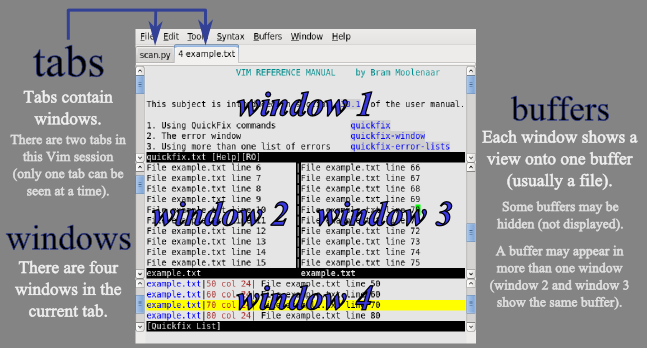

# Vim - Awesome Keyboard Shorcuts

### key mappings

- `<leader>` = `,`

### Switch modes

- `<esc>` or `<C-[>` to normal mode

### Verbs in Vim

- `d` Delete
- `c` Change
- `>` Indent
- `v` Visually select
- `y` Yank

### Structure of an Editing Command

```
editing commands = <number><command><text object or motion>
```

### MOVEMENTS

Motions: `wW bB eE fF tT`

```
h        -   Move left
j        -   Move down
k        -   Move up
l        -   Move right
3j       -   Move 3 lines down
$        -   Move to end of line
0        -   Move to beginning of line (including whitespace)
^        -   Move to first character on line
gg       -   Move to first line of file
G        -   Move to last line of file
3G       -   Go to line 3
:3<CR>   -   Go to line 3

w        -   Move forward to next word, with cursor on first character (use W to jump by whitespace only)
b        -   Move backward to next word, with cursor on first character (use B to jump by whitespace only)
e        -   Move forward to next word, with cursor on last character (use E to jump by whitespace only)
ge       -   Move backwards to next word, with cursor on last character (use gE to jump by whitespace only)
(        -   Move to beginning of previous sentence. Use ) to go to next sentence
{        -   Move to beginning of previous paragraph. Use } to go to next paragraph
+        -   Move forward to the first character on the next line
-        -   Move backwards to the first character on the previous line

<C-u>    -   Move up by half a page
<C-d>    -   Move down by half a page
<C-b>    -   Move up by a page
<C-f>    -   Move down by a page

H        -   Move cursor to header (top) line of current visible window
M        -   Move cursor to middle line of current visible window
L        -   Move cursor to last line of current visible window

fc       -   Move cursor to next occurrence of character c on the current line (inclusive). Use Fc to move backwards
tc       -   Move cursor till next character c on the current line (exclusive). Use Tc to move backwards
%        -   Move cursor to next brace, bracket or comment paired to the current cursor location

*        -   Search forward for word under cursor
#        -   Search backwards for word under cursor
/word    -   Search forward for word. Accepts regular expressions to search
?word    -   Search backwards for word. Accepts regular expressions to search
n        -   Repeat the last / or ? command
N        -   Repeat the last / or ? command in the opposite direction

# Advanced motions

()       -   Move to prev / next sentences ("." delimited words)
{}       -   Move to prev / next paragraphs (next empty line)

]]       -   Move N times to next section or `{` (Depending on your current filetype this may move between functions); `[[` to previous section
][       -   Move N times to next section or `}`

])       -   Move N times forward to unmatched parentheses, backward `[(`
]}       -   Move N times forward to unmatched braces, backward `[{`

''       -   Move to previous line position
```


### NORMAL MODE -> INSERT MODE

```
i        -   Enter insert mode to the left of the cursor
a        -   Enter insert mode to the right of the cursor
I        -   Enter insert mode at first character of current line
A        -   Enter insert mode at last character of current line

o        -   Insert line below current line and enter insert mode
O        -   Insert line above current line and enter insert mode
```

### DELETION & CHANGING

```
x        -   Delete character forward (under cursor). use x do delete backwards (before cursor)
r        -   Replace single character under cursor, and remain in normal mode. Use `R` replace multiple characters
s        -   Delete character under cursor, then switch to insert mode. Does the same thing as `x` then `i`

dm       -   Delete in direction of movement m. For m, you can also use w, b, or any other variation.
            `d3e` - delete 3 words.
            `bdw` - back delete word.
dd       -   Delete entire current line. `3dd` to delete 3 lines
D / d$   -   Delete until end of line

c        -   Change (Same as `d` but put me in insert mode)
cm       -   Change the character or word (w) in motion m, then enter insert mode
cc / S   -   Change current line and enter insert mode (unlike dd which leaves you in normal mode)
C / c$   -   Change from cursor to end of line, and enter insert mode
c0       - Change to begining of line and enter insert mode
```

### YANK & PUT

```
y        -   Yank (copy) highlighted text
yy       -   Yank current linepPut (paste) yanked text below current line
yw       -   Yank a word from the cursor
ynw      -   Yank n words from the cursor
y$       -   Yank till the end of the line
p        -   Yank register below cursor line
P        -   Put yanked text above current line
J        -   Join current line with the next line. Use gJ to exclude join-position space
xp       -   Transpose two letters (delete and paste, technically)

# More cool tricks:

"0 p       - paste from last yanked text
"+ y<CR>   - copy to the system clipboard
"+ p       - paste from the system clipboard
x  p       - swap two characters (`x` to delete one character, then `p` to put it back after the cursor position)
```


### REGISTERS

When you copy and cut stuff, it gets saved to registers. You can pull stuff from those registers at a later time.

```
:reg          -   show named registers and what's in them
"5y           -   yank to register "5
"5p           -   paste what's in register "5

# Special registers

""            -   no-name register (quotation register) - last cut/del/yank
"0            -   last-yanked register
"0 ~ "9       -   Nth-yanked register
"-            -   small delete register (deletes which are less than a complete line)

"_            -   blackhole register --> `"_d` delete and throw to blackhole

"/            -   last searched pattern

# (Read-only registers)
".            -   last inserted text
"%            -   current filename
"#            -   alternate file name (last edited file)
":            -   last command

# Tricks in command mode for registers
# Either in search mode `/` or in last line command mode `:`

:<C-r>0       -   paste last yanked text
:<C-r>%       -   paste current filename

# Also use `@ <register>` for variable:

:echo @0      -   paste last yanked text
:echo @%      -   print current filename
```

### VISUAL MODE

```
v        -   Enter visual mode and highlight characters
V        -   Enter visual mode and highlight lines
CTRL+v   -   Enter visual block mode and highlight exactly where the cursor moves
o        -   Switch cursor from first & last character of highlighted block while in visual mode
~        -   Swap case under selection
U        -   Uppercase
u        -   Lowercase
gUiw     -   (normal mode) Change current word to uppercase
<<       -   Shift lines to left
>>       -   Shift lines to right

vat      -   Highlight all text up to and including the parent element
vit      -   Highlight all text up to the parent element, excluding the element
vac      -   Highlight all text including the pair marked with c (like va<, va' or va")
vic      -   Highlight all text inside the pair marked with c
vfw      -   Highlight to next char "w"
vtw      -   Highlight 'til next char "w"
```


### FILES

```
:pwd              -   print working directory
<leader>cd        -   set working directory to the directory of the open buffer
:cd %:p:h         -   set working directory to the directory of the open buffer

# See [more...](https://vim.fandom.com/wiki/Set_working_directory_to_the_current_file)

<Shift> ZZ        -   Write current file, if modified, and quit
<Shift> ZQ        -   Force exit without saving
:e path/to/file   -   edit new file (buffer)
:e!               -   revert to last save (or use :earlier 1f)
:w !sudo tee %    -   force write with sudo trick. % (special variables) "the current file"
:w!               -   force write
:w new.txt        -   save (save content to new.txt while keeping original.txt as the opened buffe)
:wall             -   save all (save all changed buffers)
:sav new.txt      -   save as (first write content to the file new.txt, then hide buffer original.txt, finally open new.txt as the current buffer)
:sav new_name + :!rm <C-r>#    - Rename files (<C-r>#  expands to an alternate-file)
```

> Note that filename with "space" must be escaped with backslash `\`.

### BUFFERS

```
<leader>o           -   [Bclose.vim] open/toggle bufexplorer
:ls (or :buffers)   -   list / show available buffers
:e filename         -   Edit a file in a new buffer

<C-^> or :b#        -   Switch between the "alternative buffers"
:bnext (or :bn)     -   go to next buffer
:bprev (of :bp)     -   go to previous buffer

:bdelete (or :bd)   -   unload a buffer (close a file). [Bclose.vim] `<leader>bd` close current; `<leader>ba` close all
:bwipeout (or :bw)  -   unload a buffer and deletes it
:b [N]              -   The number of the buffer you are interested to open
:b [filename]       -   Swith to buffer (fuzzy matching)
:ball               -   opens up all available buffers in horizontal split window
:vertical ball      -   opens up all available buffero in vertical split window
:q                  -   close the buffer window
:help buffers       -   help for buffers
:r <file_path>      -   reads a file from the path to the buffer
:r !<command>       -   reads the output of the command into buffer
:.! cat <file_path> -   reads the output of the command (eg: cat) into buffer or !! in ex-mode
```

set the config:

```
set wildmenu wildmode=full 
set wildchar=<Tab> wildcharm=<C-Z>
```



### WINDOWS (PANES) MANAGEMENT

```
# Split screen

:sp[lit] filename   - horizontal split window and load another file. CLI `vim -o file1 file2`
:vs[plit] filename  - vertical split window and load another file. CLI `vim -O file1 file2`
:new                - horizontal split with new file
:vnew               - vertical split with new file
:clo[se]            - close current window
:hide               - hide current window
:only               - keep only this window open
:sview file         - same as split, but readonly

# Switch between panes

- `<C-w> [hjkl]` or `<C-hjkl>` - move cursor up/down/left/right a window (`<C-w> arrow`)
- `<C-w> w`                    - move cursor to another window (cycle)

# Shortcuts

<C-w> s             - split current window horizontally
<C-w> v             - split current window [v]ertically
<C-w> c             - close current window
<C-w> m             - move to window according to motion m
<C-w> n (or :new)   - open new window (horizontally)
<C-w> o             - Close every window in the current tabview but the current one
<C-w> T             - 當前窗口移動到新標籤頁

# Resizing

:resize 20          - Horizontal resize in active window
:vertical resize 20 - Virtical resize in active window
<C-w> _             - maximize height
<C-w> |             - maximize width
<C-w> =             - make all equal size
<C-w> >             - Incrementally increase the window to the right. Takes a parameter, e.g. CTRL-w 20 >
<C-w> <             - Incrementally increase the window to the left. Takes a parameter, e.g. CTRL-w 20 <
<C-w> -             - Incrementally decrease the window's height. Takes a parameter, e.g. CTRL-w 10 -
<C-w> +             - Incrementally increase the window's height. Takes a parameter, e.g. CTRL-w 10 +

# More split manipulation

" Rotate (swap) top/bottom or left/right split
<C-w> R

" Break out current window into a new tabview
<C-w> T

# Diff

:windo diffthis              -  diff between 2 vsplit windows
:diffs, diffsplit {filename} -  diffs the current window with the file given
:diffoff                     -  turns off diff selection
```

### TAB VIEWS

```
:tabe filename      -   opens the file in newtab
:tabf[ind] {file}   -   open a new tab with filename given, searching the 'path' to find it
:tabe new           -   open an empty tab
:tabs               -   list opened tabs
:tabc [I]           -   close the active (i-th) tab
:tabo[nly]          -   close all other tabs (show only the current tab)
:tabn and tabp      -   Go to next tab or previous tab
:tabfirst           -   Go to the first available tab
:tablast            -   Go to the last available tab
:help tabpage       -   help for tabs

vim -p *.txt        -   open all txt files in tabs

# Moving tabs

:tabm 0             - move current tab to first
:tabm               - move current tab to last
:tabm {i}           - move current tab to position i+1

# TAB NAVIGATION

gt                  - goto next tab
gT                  - goto prev. tab
{i}gt               - go to tab in position i

# Shortcuts

<leader>tn          - tab new
<leader>tc          - tab close
<leader>to          - tab only
<leader>tm          - tab move
<leader>te          - open a new tab with the current buffer's path

noremap tl <Esc>:tabnext<CR>
noremap th <Esc>:tabprevious<CR>
```

### MACROS

You can also record a whole series of edits to a register, and then apply them over and over.

```
qk       -  records edits into register k (`q` again to stop recording)
@k       -  execute recorded macro
@@       -  repeat last one
5@@      -  repeat 5 times

"kp      -  print macro k (e.g., to edit or add to .vimrc)
"kd      -  replace register k with what cursor is on
```


### VIM FOLDING

```
zf#j      -   creates a fold from the cursor down # lines.
zf/string -   creates a fold from the cursor to string .
v{move}zf -   creates a visual select fold
zf'a      -   creates a fold from cursor to mark a

zo        -   opens a fold at the cursor.
zO        -   opens all folds at the cursor.
za        -   Toggles a fold at the cursor.
zc        -   closes a fold at the cursor.
zM        -   closes all open folds.
zd        -   deletes the fold at the cursor.
zE        -   deletes all folds.

zj        -   moves the cursor to the next fold.
zk        -   moves the cursor to the previous fold.
zm        -   increases the foldlevel by one.
zr        -   decreases the foldlevel by one.
zR        -   decreases the foldlevel to zero -- all folds will be open.
[z        -   move to start of open fold.
]z        -   move to end of open fold.

:set foldmethod=manual         -  default method v{select block}zf to fold
:set foldmethod=marker         -  use marker fold method {{{
:set foldemethod=marker/*,*/   -  user custom marker fold method
:set foldmethod=indent         -  automatically fold programms per its indentation
```


### HISTORY/COMMAND BUFFER

```
q:              -   list history in command buffer
q/              -   search history in command buffer
# Another way: press the 'cedit' key (default is `Ctrl-f`) in command mode `:` or search mode `/`
# Then press `Enter` to execute the current line
<C-c> <C-c>     -   close the command buffer

:set list       -   show hidden characters

<C-n>           -   Press after typing part of a word. It scrolls down the list of all previously used words
<C-p>           -   Press after typing part of a word. It scrolls up the list of all previously used words

!               -   Turn a command into a toggle command, e.g., `:set cursorline <-> :set nocursorline` == `:set cursorline!`

<C-g> or `:f`   -   Show file name
1<C-g>          -   Show full file path
```

### FILETYPE

```
:setf html      -   Set FileType to html
:set ft?        -   Show current FileType
gg=G            -   Re-indent for current FileType
```

### SEARCH & REPLACE

```
/pattern                -   search forward for pattern
?pattern                -   search backward
n                       -   repeat forward search
N                       -   repeat backward
:nohl or <leader><CR>   -   no highlight on search result
:set ignorecase         -   case insensitive
:set smartcase          -   use case if any caps used
:set incsearch          -   show match as search proceeds
:set hlsearch           -   search highlighting

More cool searching tricks:

*                 - search for word currently under cursor  (bounded)
g*                - search for partial word under cursor    (unbounded)
                (repeat with n)
#                 - search for word under cursor - backward (bounded)
g#                - search for word under cursor - backward (unbounded)
[I                - show lines with matching word under cursor.
```

**Go through jump list** (a list of places where your cursor has been to)

```
:<linenum>            - go to <linenum>

`` (double backtick)  - jump between previous position and the current position cursor position in jump list
`.                    - bring you to your **last change**

                    (The ` goes to a mark, and "." is a "special" mark which is automatically
                     set to the position where the last change was made)

<C-o> and <C-i>       - up / down walk through the jump list history
g; and g,             - jump through [edit positions](), which are also very frequently used
```


- `:%s/search_for_this/replace_with_this/gc` - replace in the whole file (%s), [c]onfirm each replace
- `:s/search_for_this/replace_with_this/gi` -  replace in the current line only, with case [i]nsensitive


### PLUGINS

[vim-commentary](https://github.com/tpope/vim-commentary)

```
gcc        -   comment out a line (takes a count)
gc         -   comment out the selection
gcap       -   comment out a paragraph
```

[surround.vim](https://github.com/tpope/vim-surround)

```
ys iw "    -   add quotes in word
ds "       -   remove the delimiters entirely
cs "'      -   change surrounding from " to '
yss )      -   wrap the entire line in parentheses

S "        -   (Visual mode) add quotes in selection
```

[NERDTree](https://github.com/scrooloose/nerdtree)

```
<leader>nn          -   toggle nerdtree
o                   -   open/close folder
p                   -   parent folder

P                   -   go to root folder
C                   -   set cursor as root folder
u                   -   set root folder to upper layer

I                   -   show hidden folder
m                   -   opens the menu
?                   -   help

i                   -   horizontal split
s                   -   vertical split
<C-w> ← | →         -   (left or right) to navigate
```

[vim-multiple-cursors (Sublime-text-flavor select)](https://github.com/terryma/vim-multiple-cursors)

```
<C-n>      -   (start) start multicursor and add a "virtual cursor + selection" on the match
<C-n>      -   (next) add a new virtual cursor + selection on the next match
<C-x>      -   (skip) skip the next match
<C-p>      -   (prev) remove current virtual cursor + selection and go back on previous match

<A-n>      -   (select all) start muticursor and directly select all matches
```

[mru](https://github.com/vim-scripts/mru.vim)

```
<leader>f      - open recently opened files
```

[fzf-vim](https://github.com/junegunn/fzf.vim)

```
:Files / :FZF    -   search for files in current directory
:FZF ~           -   Look for files under your home directory
:Buffers         -   search for opened buffers
:Ag              -   Full-text search (ALT-A to select all, ALT-D to deselect all)

# Open files
<Enter>   -   open in current window
<C-t>     -   open in a new tab
<C-x>     -   open in a new split
<C-v>     -   open in a new vertical split
```

### MISCELLANEOUS

```
u        -   Undo
U        -   Undo all changes on current line
<C-R>    -   Redo
.        -   Redo last change

g~       -   switch case under cursor
g~$      -   Toggle case of all characters to end of line.
g~~      -   Toggle case of the current line (same as V~).
gUU      -   switch the current line to upper case
guu      -   switch the current line to lower case

<C-a>    -   Increment the number at cursor
<C-x>    -   Decrement the number at cursor

.        -   Repeat last change or delete
;        -   Repeat last f, t, F, or T command
,        -   Repeat last f, t, F, or T command in opposite direction

:%sort   -   Sort in visual mode. Use `:%sort!` to sort in reverse order; `:%sort n` for numeric sort.

g <C-g>  -   Show statistics (word count, ...)
<C-g>    -   Show line info

vim +10 <file_name>            - opens the file at line 10
vim +/bash cronjob-lab.yml     - opens the file cronjob-lab.yml on the first occurence of bash

vim scp://balasundaramm@mgmt-bst:22/~/automation/test-file.txt - Edit a remote file via scp

:set nonumber            -  disable line number
:set norelativenumber    -  disable relative line number

1 <C-g>  -   View the full path of the file
```

---

### Text Objects

https://blog.carbonfive.com/2011/10/17/vim-text-objects-the-definitive-guide/

Plaintext Text - Words

- `iw` inner word
- `as` around sentence

Plaintext Text - Paragraphs

- `ip` inner paragraph

Quoted Strings

- `a"` -- a double quoted string
- `i"` -- inner double quoted string
- `a'` -- a single quoted string
- `i'` -- inner single quoted string
- `at` -- a html tag
- `it` -- inner html tag
- `a>` -- a single tag
- `i>` -- inner single tag

Parentheses Text Objects

- `i)` -- inner parenthesized block
- `i]` -- inner bracket
- `i}` -- inner brace block
- <code>a\`</code> -- a back quoted string
- <code>i\`</code> -- inner back quoted string

> [CamelCaseMotion](https://github.com/bkad/CamelCaseMotion) provides a text object to move by words within a camel or snake-cased word.

### Code editing

- `<leader>pp`         - toggle paste mode
- `:set syntax=python` - change syntax highlighting

### Advanced Editing

http://vim.wikia.com/wiki/Moving_around

- `df␣` cuts to first non-whitespace character
- replace a word with yanked text: `yiw` in "first" then `viwp` on "second"

### Special Variables

https://vim.fandom.com/wiki/Get_the_name_of_the_current_file

- `:echo @%` directory/name of file (relative to the current working directory)
- `:echo expand('%:t')` name of file
- `:echo expand('%:p')` full path
- `:echo expand('%:p:h')` directory containing file ('head')
- `:echo expand('%:r')` name of file less one extension ('root')
- `:echo expand('%:e')` name of file's extension ('extension')
- `:cd %:p:h` change the working directory to the file being edited. (`:p` Make file name a full path. `:h` Head of the file name)

### Vim paste in command mode - `Ctrl-r`

http://vimdoc.sourceforge.net/htmldoc/insert.html#i_CTRL-R

Use `<C-r> register` when entering a command in _command mode_ or _insert mode_ to paste the register contents. Substitute for a register name:

- `<C-r> "` for last delete or yank
- `<C-r> 0` for yanked register
- `<C-r> .` for last inserted text
- `<C-r> %` for current filename
- `<C-r> /` for last search term
- `<C-r> +` for the `X clipboard` or a host of other substitutions


## References

- [Today I learned: Vim](http://tilvim.com/)
- [VIM KEYBOARD SHORTCUTS](https://gist.github.com/leoluyi/2770d1d8596bb9cf594432dfa56ef825)
- [buffers vs tabs?](https://stackoverflow.com/a/26710166/3744499)
- [vim--buffers-and-windows](https://www.openfoundry.org/tw/tech-column/2383-vim--buffers-and-windows)
- [Huckleberry Vim](https://github.com/shawncplus/vim-classes/blob/master/expert-1.md)
- [vimrc](https://github.com/amix/vimrc)
- [most-used vim commands/keypresses](https://stackoverflow.com/a/5400978)
- [How to save as a new file and keep working on the original one in Vim?](https://stackoverflow.com/a/9927057/3744499)
- [Vim registers: The basics and beyond](https://www.brianstorti.com/vim-registers/)
- [skwp/dotfiles#vim](https://github.com/skwp/dotfiles#vim---whats-included)
- [vim help](https://www.cs.swarthmore.edu/oldhelp/vim/)
- [vim-buffer](https://harttle.land/2015/11/17/vim-buffer.html)
- [vim-window](https://harttle.land/2015/11/14/vim-window.html)

**Videos**

- [Vim Basics in 8 Minutes](https://www.youtube.com/watch?v=ggSyF1SVFr4)
- [A Vid in which Vim Saves Me Hours & Hundreds of Clicks](https://www.youtube.com/watch?v=hraHAZ1-RaM)
